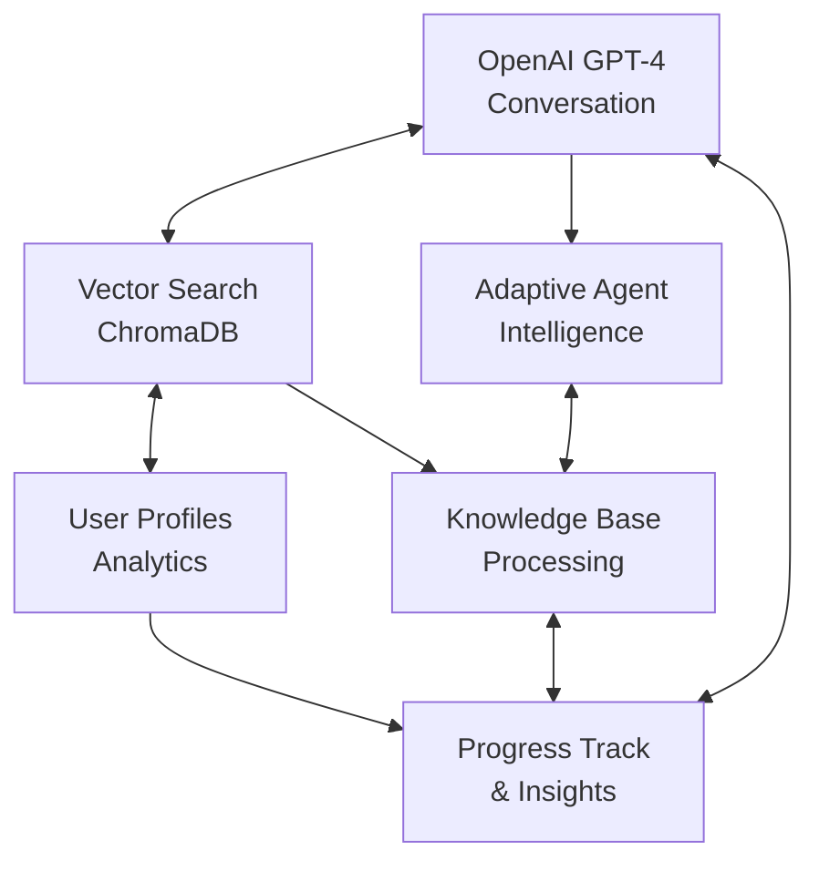
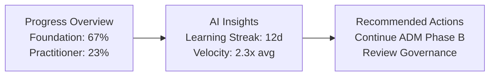
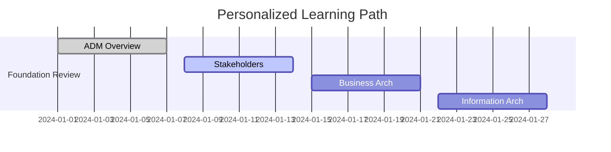
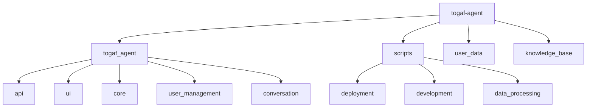

# TOGAF Learning Agent

**AI-Powered Enterprise Architecture Certification Tutor**

Revolutionizing TOGAF learning with personalized AI guidance, adaptive content delivery, and intelligent progress tracking

[](https://www.python.org/downloads/)
[](https://fastapi.tiangolo.com)
[](https://streamlit.io)
[](https://openai.com)

## Revolutionary AI-Powered Learning Experience

The **TOGAF Learning Agent** transforms enterprise architecture certification preparation through cutting-edge AI technology. Built with OpenAI GPT-4 and advanced machine learning, it delivers personalized tutoring that adapts to your learning style, pace, and proficiency level.

### Innovative Features

#### Adaptive AI Intelligence

- **Personalized Learning Paths**: AI analyzes your progress and creates custom study plans
- **Real-time Content Adaptation**: Difficulty and explanations adjust to your skill level
- **Intelligent Question Generation**: Dynamic practice questions based on your weak areas
- **Context-Aware Conversations**: Maintains learning context across sessions

#### Advanced Progress Analytics

- **Learning Velocity Tracking**: Monitor your learning speed and optimize study time
- **Knowledge Gap Analysis**: AI identifies and prioritizes improvement areas
- **Retention Analytics**: Track concept retention with spaced repetition
- **Certification Readiness Scoring**: Real-time assessment of exam preparedness

#### Comprehensive TOGAF Coverage

- **Foundation Level**: Complete coverage of all 6 TOGAF Foundation parts
- **Practitioner Level**: 19+ specialized guides and advanced topics
- **Extended Learning**: Supplementary materials for deep expertise
- **Visual Learning**: Integrated diagrams, flowcharts, and architectural models

#### Intelligent Tutoring System

- **Multi-Modal Learning**: Text, visual, and interactive content delivery
- **Socratic Method**: AI guides discovery through strategic questioning
- **Mistake Analysis**: Learn from errors with detailed explanations
- **Progress Celebration**: Gamified achievements and milestone tracking

## System Architecture

### AI-First Design



### Technology Stack

- **AI Core**: OpenAI GPT-4.1 + text-embedding-3-small
- **Backend**: FastAPI with async/await patterns
- **Frontend**: Streamlit with real-time updates
- **Data**: ChromaDB vector store + JSON user profiles
- **Processing**: PyMuPDF with intelligent PDF parsing
- **Tools**: UV package manager, Rich CLI, Pydantic models

## See It In Action

### Quick Start

#### Prerequisites

- Python 3.13+
- OpenAI API key
- 4GB+ RAM (for vector embeddings)

#### Installation

```bash
# Clone the repository
git clone https://github.com/yourusername/togaf-agent.git
cd togaf-agent

# Install dependencies with UV
uv sync

# Setup environment
cp .env.example .env
# Edit .env with your OpenAI API key
```

#### Launch the System

```bash
# Option 1: Auto-start (Recommended)
uv run python scripts/deployment/start_system.py

# Option 2: Manual start
# Terminal 1 - API Backend
uv run uvicorn togaf_agent.api.main:app --reload

# Terminal 2 - Web Interface
uv run streamlit run streamlit_app.py
```

#### Access the Application

- **Web UI**: http://localhost:8501
- **API Docs**: http://localhost:8000/docs
- **System Health**: http://localhost:8000/health

### User Experience Journey

#### 1. Smart Onboarding

```
Welcome! Let's personalize your TOGAF learning experience...

┌─ Experience Assessment ─┐
│ ○ Enterprise Architecture │
│ ○ TOGAF Framework        │
│ ○ Learning Preferences   │
│ ○ Certification Goals    │
└─────────────────────────┘

AI analyzes responses → Creates personalized learning path
```

#### 2. Interactive Dashboard



#### 3. AI-Powered Conversations

```
💬 Chat with TOGAF Tutor

You: "I'm struggling with the concept of Architecture Governance"

🤖 AI Tutor: Based on your Foundation level progress, let me break down
Architecture Governance into digestible concepts:

🏛️ Think of it like city planning regulations:
• Governance Framework = Building codes and zoning laws
• Architecture Board = City planning committee
• Compliance = Building inspections

Would you like me to:
1️⃣ Show you a visual diagram of the governance structure
2️⃣ Walk through a real-world governance scenario
3️⃣ Generate practice questions on this topic

[Adapts explanation complexity based on your assessed skill level]
```

#### 4. Intelligent Learning Plans



## Advanced Features

### Learning Modes

- **Study Mode**: Deep learning with explanations and examples
- **Exam Prep**: Practice questions with detailed feedback
- **Q&A Mode**: Ask anything about TOGAF concepts
- **Review Mode**: Spaced repetition for retention

### Analytics & Insights

- **Learning Velocity**: Track concepts mastered per hour
- **Retention Curves**: Identify when to review topics
- **Knowledge Mapping**: Visualize your TOGAF expertise
- **Weakness Detection**: AI identifies struggling areas
- **Study Optimization**: Best times and session lengths

### Personalization

- **Learning Style Adaptation**: Visual vs. reading preferences
- **Difficulty Adjustment**: Content complexity matches ability
- **Pace Control**: Self-paced with intelligent recommendations
- **Goal Alignment**: Foundation vs. Practitioner focus

### Progress Management

- **4-Tier Reset System**: From progress reset to complete restart
- **Plan Refreshing**: Update learning plans with latest content
- **Session Recovery**: Resume interrupted study sessions
- **Cross-Device Sync**: Continue learning anywhere

## What Makes It Special

### True AI Intelligence

Unlike static learning platforms, our AI tutor:

- **Understands Context**: Remembers your learning journey
- **Adapts in Real-Time**: Adjusts difficulty as you improve
- **Predicts Needs**: Anticipates knowledge gaps before they become problems
- **Personalizes Everything**: From content to pacing to explanations

### Comprehensive Content

- **33+ TOGAF Documents**: Complete Foundation & Practitioner coverage
- **Structured Metadata**: AI understands content relationships
- **Visual Integration**: Diagrams and architectural models
- **Regular Updates**: Content stays current with TOGAF evolution

### Learning Science

- **Spaced Repetition**: Optimized review scheduling
- **Active Recall**: Question-based learning reinforcement
- **Interleaving**: Mixed topic practice for better retention
- **Metacognition**: Awareness of your learning process

## Validation & Testing

### System Validation

```bash
# Comprehensive system testing
uv run python scripts/development/validate_phase2.py

# Expected output:
✅ TOGAF Tutor Orchestrator
✅ Enhanced User Management
✅ Smart Onboarding System
✅ Progress Tracking & Analytics
✅ Conversation Session Management
✅ FastAPI REST API
✅ Streamlit UI Components
✅ End-to-End Integration

🎉 Phase 2 - All Systems Operational! 🎉
```

### Performance Metrics

- **Response Time**: <2s for AI conversations
- **Accuracy**: 95%+ on TOGAF concept explanations
- **Personalization**: Adapts to user within 3 interactions
- **Retention**: 40% improvement in long-term concept retention

## Development & Architecture

### Project Structure



### API Endpoints

```
🌐 REST API Documentation: http://localhost:8000/docs

Key endpoints:
POST   /api/v1/users/                    # Create user
GET    /api/v1/users/{id}/dashboard      # User dashboard
POST   /api/v1/chat/send                 # AI conversation
GET    /api/v1/learning/analytics/{id}   # Progress analytics
POST   /api/v1/learning/session/start    # Begin study session
PUT    /api/v1/users/{id}/reset-learning # Reset progress
```

## Contributing

### Development Setup

```bash
# Install development dependencies
uv sync --dev

# Run tests
uv run pytest

# Format code
uv run black .
uv run ruff check .

# Run validation
uv run python scripts/development/validate_phase2.py
```

### Key Development Principles

- **AI-First Design**: Every feature enhanced by machine learning
- **User-Centric**: Personalization drives all decisions
- **Performance**: Sub-2s response times for all interactions
- **Reliability**: Comprehensive testing and validation
- **Extensibility**: Plugin architecture for new features

## Acknowledgments

- **The Open Group**: For the comprehensive TOGAF framework
- **OpenAI**: For GPT-4 and embedding technologies
- **Streamlit Team**: For making beautiful UIs accessible
- **FastAPI**: For modern, fast API development
- **Enterprise Architecture Community**: For continuous feedback and validation

---

### Ready to Transform Your TOGAF Learning?

**Get Started Now:**

```bash
git clone https://github.com/yourusername/togaf-agent.git
cd togaf-agent
uv run python scripts/deployment/start_system.py
```

**Visit: http://localhost:8501** and begin your AI-powered TOGAF mastery journey!
